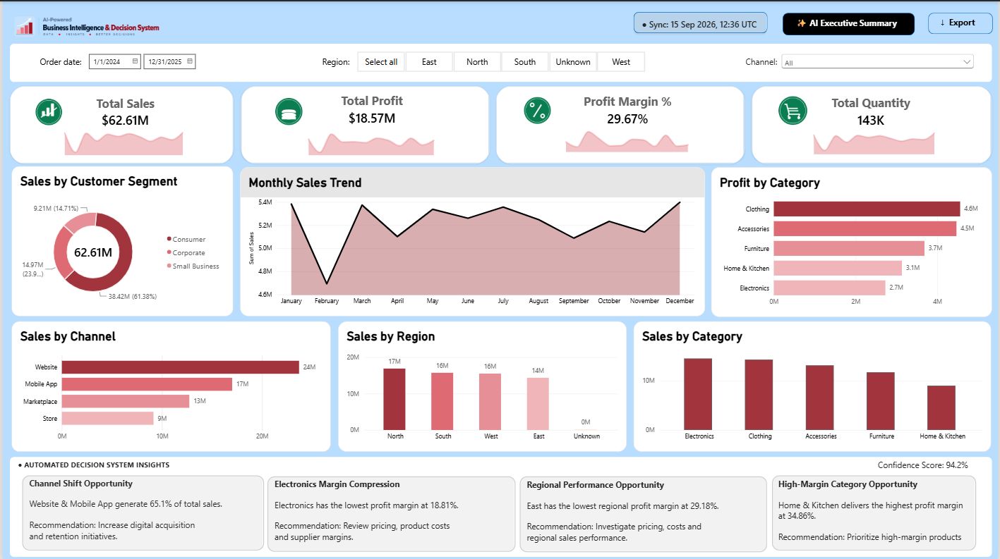
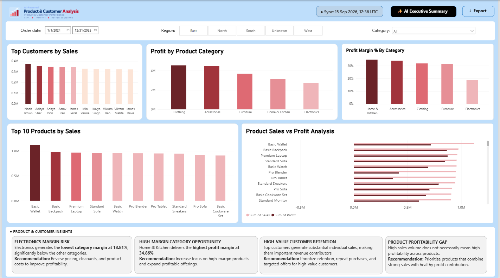
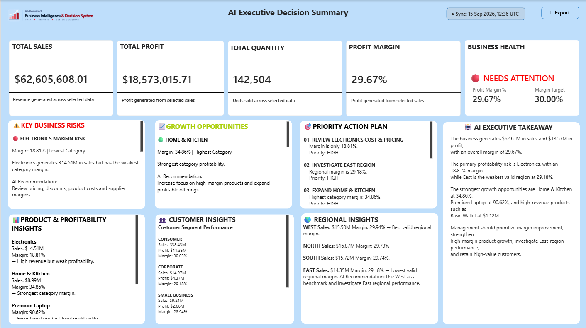

# AI-Powered Business Intelligence & Decision System

An end-to-end Business Intelligence and Decision Support System designed to transform raw sales data into actionable business insights using **Python, MySQL, Power BI, and Generative AI**.

---

## 📌 Project Overview

This project demonstrates a complete analytics pipeline for a fictional retail business.

The system combines data cleaning, SQL analytics, business intelligence dashboards, AI-generated insights, and decision recommendations into a single workflow.

### Technology Stack

- Python
- Pandas
- MySQL
- SQL
- Power BI
- Google Gemini AI
- Git & GitHub
- CSV / JSON

---

## 🎯 Business Objective

The objective of this project is to help management understand:

- Sales performance
- Profitability
- Product performance
- Customer behavior
- Regional performance
- Sales channel performance
- Business risks
- Growth opportunities
- Actionable strategic recommendations

---

## 🏗️ Project Architecture

```text
Raw Sales Data
      │
      ▼
Data Quality Validation
      │
      ▼
Data Cleaning & Transformation
      │
      ▼
Clean Sales Dataset
      │
      ├──────────────► MySQL
      │                    │
      │                    ▼
      │              SQL Business Analysis
      │
      ▼
Power BI Dashboard
      │
      ▼
Business Metrics & KPIs
      │
      ▼
AI Decision Engine
      │
      ▼
Google Gemini AI
      │
      ▼
AI-Generated Business Insights
      │
      ▼
Executive Decision Summary

---

## Dashboard Preview

### Executive Dashboard



### Product & Customer Analysis



### AI Executive Decision Summary



---